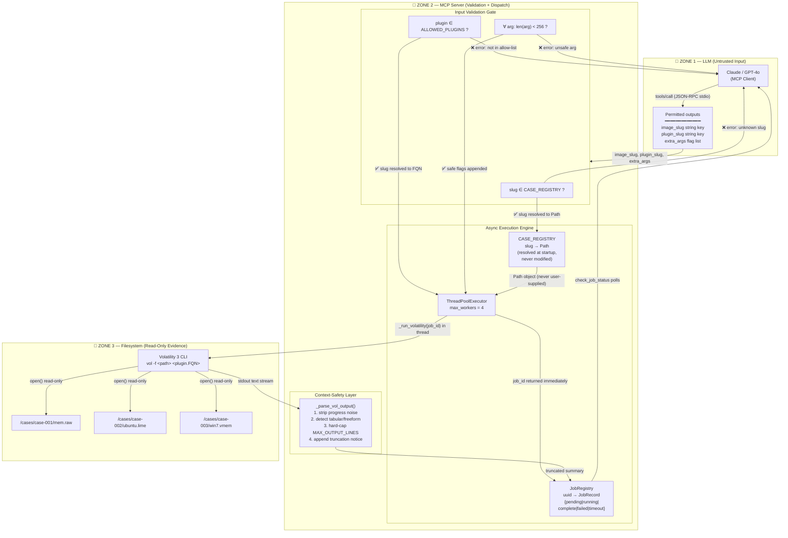

# Architecture — Protocol-SIFT-Async-Bridge

This document defines the three trust zones of the system and shows exactly which
data crosses each boundary, in which direction, and under what validation.

## Architectural Pattern

This project implements the **Custom MCP Server** pattern: a purpose-built FastMCP
server exposes a small, type-safe set of forensic tools (8 total — see "MCP Tool
Reference" in `README.md`) to any MCP-compatible LLM client, rather than wrapping a
generic shell or extending an existing agent framework.

## Architectural Guardrails vs. Prompt Guardrails

Every control on this page is an **architectural guardrail** — enforced in code, at
the protocol/process boundary, independent of what the LLM is told in its system
prompt. None of the rows in "What CANNOT Happen" below rely on the model choosing to
behave; they hold even if the model is adversarial or malfunctioning, because the
corresponding *capability does not exist* in the tool surface (no write tool, no
shell-exec tool, no arbitrary-path tool). This is the opposite of a prompt-based
restriction such as "please don't write to the evidence file" — see
`docs/accuracy_report.md` → "Accuracy Self-Assessment" → "Evidence Integrity" for
the explicit no-op trace of what happens if the model attempts to ignore a
restriction anyway.

---

## Trust Zone Map (Mermaid — renders on GitHub)



---

## ASCII Trust Boundary Diagram (terminal-safe)

```
╔══════════════════════════════════════════════════════════════════════════╗
║  ZONE 1 — LLM (Untrusted)                                               ║
║                                                                          ║
║   Claude / GPT-4o                                                        ║
║                                                                          ║
║   WHAT IT CAN SEND                    WHAT IT CANNOT SEND               ║
║   ─────────────────────────────────   ───────────────────────────────── ║
║   image_slug  = "case-001-win10"      /cases/case-001/mem.raw           ║
║   plugin_slug = "pslist"              windows.pslist.PsList              ║
║   extra_args  = ["--pid", "4892"]     ../../etc/shadow                  ║
║                                       arbitrary shell commands           ║
╚════════════════════════╤═════════════════════════════════════════════════╝
                         │ JSON-RPC over stdio
                         │ (only slug strings cross this boundary)
╔════════════════════════▼═════════════════════════════════════════════════╗
║  ZONE 2 — MCP Server  (Protocol-SIFT-Async-Bridge)                      ║
║                                                                          ║
║  ┌─ Validation Gate ──────────────────────────────────────────────────┐ ║
║  │  slug ∈ CASE_REGISTRY  →  reject if unknown                        │ ║
║  │  plugin ∈ ALLOWED_PLUGINS  →  reject if not in dict               │ ║
║  │  len(arg) < 256  →  reject if oversized                           │ ║
║  └────────────────────────────────────────────────────────────────────┘ ║
║                                                                          ║
║  ┌─ CASE_REGISTRY (immutable after startup) ─────────────────────────┐ ║
║  │  "case-001-win10"  →  Path("/cases/case-001/mem.raw")  resolved   │ ║
║  │  "case-002-ubuntu" →  Path("/cases/case-002/ubuntu.lime") resolved │ ║
║  │  User input NEVER modifies this map                                │ ║
║  └────────────────────────────────────────────────────────────────────┘ ║
║                                                                          ║
║  ┌─ ThreadPoolExecutor (max 4) ──────────────────────────────────────┐ ║
║  │  _run_volatility(job_id)  ←  background thread                    │ ║
║  │  returns job_id immediately  →  no LLM block                      │ ║
║  └─────────────────────────────┬──────────────────────────────────────┘ ║
║                                │                                         ║
║  ┌─ Context Safety ────────────▼──────────────────────────────────────┐ ║
║  │  _parse_vol_output()                                                │ ║
║  │    strip progress spinners                                          │ ║
║  │    cap to MAX_OUTPUT_LINES (default 120)                           │ ║
║  │    set truncated=True + append notice                              │ ║
║  └────────────────────────────────────────────────────────────────────┘ ║
╚════════════════════════╤═════════════════════════════════════════════════╝
                         │ subprocess.run(["vol", "-f", Path, FQN], timeout=180)
                         │ (Path and FQN come from registry, NEVER from user)
╔════════════════════════▼═════════════════════════════════════════════════╗
║  ZONE 3 — Filesystem (Read-Only Evidence)                               ║
║                                                                          ║
║   Volatility 3 opens image file in READ-ONLY mode                       ║
║   No --output-dir flag → no files written during default analysis       ║
║   stdout piped back through Zone 2 context-safety layer                 ║
║                                                                          ║
║   /cases/case-001/mem.raw        (Windows 10 — 16 GB)                   ║
║   /cases/case-002/ubuntu.lime    (Ubuntu 22.04 — 8 GB)                  ║
║   /cases/case-003/win7.vmem      (Windows 7 SP1 — 4 GB)                 ║
╚══════════════════════════════════════════════════════════════════════════╝
```

---

## Data Flow Trace — Single Launch → Poll Cycle

```
t=0ms   LLM calls tools/call:launch_volatility_plugin
        ├─ args: {"image_slug":"case-001-win10","plugin_slug":"pslist"}
        ├─ [Zone 2] slug validated → Path resolved → job_id="abc-123" created
        ├─ [Zone 2] thread submitted to pool
        └─ [Zone 2] returns {"job_id":"abc-123","status":"pending"} in < 5ms

t=5ms   Background thread starts
        ├─ [Zone 2→3] subprocess.run(["vol","-f","/cases/.../mem.raw",
        │              "windows.pslist.PsList"], timeout=180)
        └─ [Zone 3] Volatility opens image read-only

t=45s   Volatility finishes → 800 rows of stdout
        ├─ [Zone 2] _parse_vol_output(): strips noise, caps at 120 rows
        ├─ [Zone 2] JobRecord updated: status="complete", truncated=True
        └─ [Zone 2] trace event written to logs/

t=50s   LLM polls tools/call:check_job_status("abc-123")
        ├─ [Zone 2] registry lookup → JobRecord returned
        └─ [Zone 2] {"status":"complete","row_count":120,"truncated":true,
                     "output_summary":"PID PPID ...[120 rows]...[TRUNCATED]"}

         ▲ The LLM never waited for the 45s Volatility run.
           It polled twice (t=5s check, t=50s check) and got results.
```

---

## What CANNOT Happen (Enforcement Points)

| Attack Vector | Blocked By | Zone |
|---|---|---|
| `image_slug="/etc/passwd"` | Key not in `CASE_REGISTRY` dict | 2 |
| `image_slug="../../cases/../bin/sh"` | Key not in registry | 2 |
| `plugin_slug="os.system"` | Key not in `ALLOWED_PLUGINS` | 2 |
| `extra_args=["--output-dir", "/exfil"]` | Length check passes but `--output-dir` not a default Volatility arg for listing plugins; documented as analyst responsibility | 2* |
| 10,000-line malfind output flooding context | `_parse_vol_output()` hard cap | 2 |
| LLM calls Volatility directly | No direct filesystem or exec tool exists | 2 |
| LLM modifies a registered image path | `CASE_REGISTRY` is a module-level constant | 2 |
| Volatility writes evidence | No `--output-dir` by default; read-only mount recommended | 3 |

> \* `--output-dir` in `extra_args` passes the length validation but is called out in the
>   README and accuracy report as an operator responsibility — the deployment should either
>   strip it from the allowed extra_args surface or mount images read-only at the OS level.
